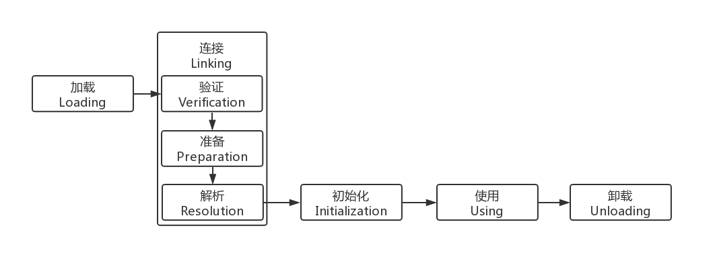
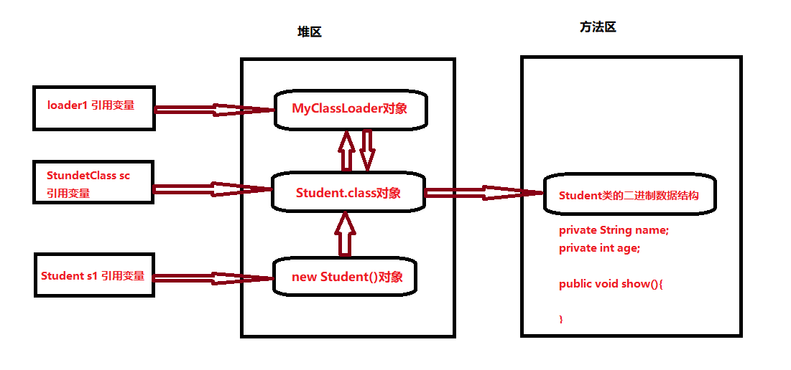
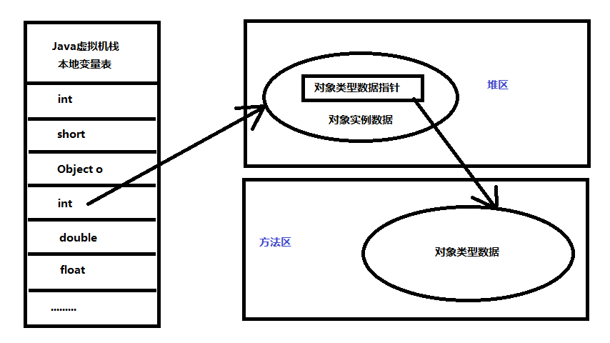

# ClassLoader

## 类加载过程

* 加载(loading)  
    查找并加载二进制数据
* 链接(linking)  
    * 验证(verifying)  
        确保被加载类的正确性
    * 准备(preparing)  
        为类的静态变量分配内存，并将其初始化为默认值
    * 解析(resolving)  
        把类中的符号引用转换为直接引用
* 初始化(initialising)  
    为类的静态变量赋予正确的初始值
    
所有的java虚拟机实现必须在每个类或者每个接口被java程序首次主动使用时才初始化他们，当然现代jvm有可能根据程序上下文语义推断出接下来可能初始化谁

* 主动使用

    * new 直接使用
    * 访问某个类或者接口的静态变量，或者对该静态变量进行赋值操作
    * 调用静态方法
    * 反射某个类
    * 初始化一个子类
    * 启动类 java HelloWord

* 被动使用

    * 除了上面的都是被动使用

## 类加载阶段介绍

类加载简单来说，就是将class文件中的二进制数据读取到内存中，将其放在方法区，
然后在堆区创建一个java.lang.Class对象，用来封装在方法区的数据结构

## 类加载最终产物

**类加载的最终产品是位于堆区的class对象**

## 类加载方式

* 本地磁盘中直接加载
* 内存中直接加载
* 通过网络加载.class
* 从zip，jar等归档文件中加载
* 数据库中提取.class
* 动态编译

## 三大阶段详解

### 1.加载阶段发生的故事

加载阶段完成后，虚拟机外部的二级制数据就会按照虚拟机所需要的格式存储在方法区（数据结构），
然后在堆内存中创建一个Class对象，这个对象作为程序访问方法区这些数据结构的
外部接口。

* Jvm内存结构

* 对象存在方式

* 对象访问方式

### 2.链接阶段发生的故事

加载阶段和链接阶段是可以交叉进行的，比如一部分代码加载完成就可以进行验证，提高效率

    

