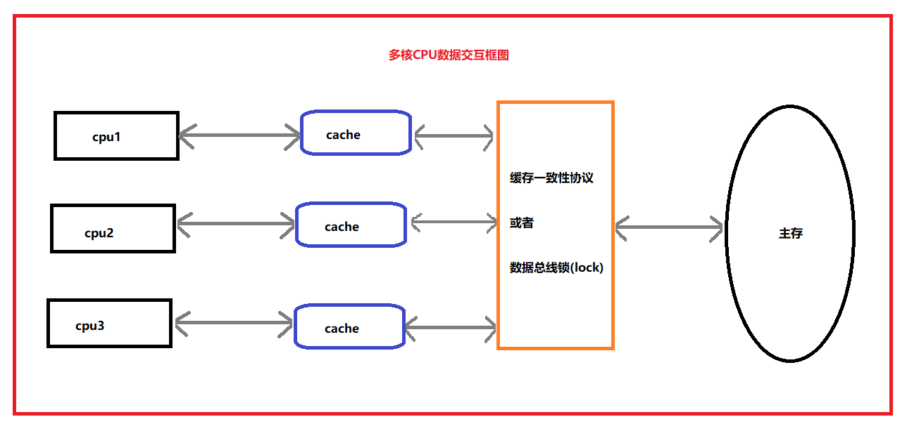

# JavaMultiThread
### Java多线程教程笔记

[Jvm虚拟机知识点讲解](../jvm-learn/jvm.md)

---
### 并发编程三个重要概念

1.原子性  
* 一个或者多个操作，要么都成功，要么都失败，中间不能有任何中断  

2.可见性  
* 共享变量可以被所有线程可见  

3.有序性  
* volatile禁止对指令进行优化重排序  
重排序：只要求最终一致性

### 线程名
Thread+递增的数字
如果不传入名字会调用nextThreadNum()的同步方法，对静态变量threadInitNumber++

### 线程组
如果构造线程对象时候，没有传入ThreadGroup,会默认获取父线程的ThreadGroup作为自己的，此时子线程和父线程会在同一个ThreadGroup中

### ThreadSize
构建线程的时候传入这个值，代表着该线程占用的stack大小 
如果没有指定这个值，则默认为0,0代表会忽略这个参数，该参数会被JNI函数去使用 
注意：该参数在一些平台有效，一些无效

### 守护线程：DaemonThread
将线程设置为守护线程，则会随着创建自己的线程的结束而结束 
t.setDaemon(true); 
注意：守护线程是随着创建自己的父线程一起结束 
**线程组设置为守护线程**： 
当线程组中最后一个线程结束时候，整个线程组销毁 

### 线程优先级
1-10 10为最大，普通优先级为5 
尽量优先最大优先级的线程执行，但是不保证 

### Thread Join
等待其他线程执行完 
join:当前线程需要等我这个线程结束再执行下面的任务

### ThreadInterrupt
线程中断 
 -interrupted() 
 -静态方法，获得线程中断标识后会将中断标识清除  
 -isInterrupted()  
 -只会获得线程是否中断，不会清除中断标识  

  真正优雅的停止线程：先设置中断标志，在程序中检测中断标志，并主动停止任务

### Synchronized 
同步方法:使用的this锁 
同步方法块:使用的对象锁 
this锁: 
对于对象锁（this），如果是同一个实例，就会按顺序访问，但是如果是不同实例，就可以同时访问。 
class锁: 
静态锁，锁的是类的字节码信息等同于synchronized (ThreadSynchronizedStatic.class)
只要采用类锁，就会拦截所有线程，只能让一个线程访问。 

### Wait Notify

* wait：等待锁资源，需要被其他线程唤醒（或者自己设置超时时间）
* notify：唤醒一个等待这个锁的线程
* notifyAll：唤醒所有等待这个锁的线程

**sleep和wait的区别？**

两者都会释放cpu执行权

1. sleep是Thread的方法，wait是Object的方法
2. sleep不会释放锁，wait会释放锁并加入对象等待队列
3. sleep不依赖锁，但是wait必须在synchronized里面
4. sleep不需要被唤醒，但是wait需要被其他线程唤醒

### Volatile关键字

一旦一个变量被volatile修饰，具备两层语义：  
* 1.保证了不同线程之间的可见性  
* 2.禁止对其进行重排序，也就是保证了有序性
* 3.并未保证原子性  
* 4.如果是写操作会导致其他cpu缓存失效

#### 使用场景

* 状态标记   
~~~
    volatile boolean flag = true;
    while(flag){
        //todo
    }
    void close(){
        flag = false;
    }
~~~

#### 内存模型:  
规定所有的变量都是存在主存当中（类似于前面说的物理内存），每个线程都有自己的工作内存（类似于前面的高速缓存）。线程对变量的所有操作都必须在工作内存中进行，而不能直接对主存进行操作。并且每个线程不能访问其他线程的工作内存。
由于java中的每个线程有自己的工作空间，这种工作空间相当于上面所说的高速缓存，因此多个线程在处理一个共享变量的时候，就会出现线程安全问题。

##### 共享变量:  
上面我们所说的t就是一个共享变量，也就是说，能够被多个线程访问到的变量，我们称之为共享变量。在java中共享变量包括实例变量，静态变量，数组元素。他们都被存放在堆内存中。

#### 线程可见性:

在多线程环境下，某个共享变量如果被其中一个线程给修改了，其他线程能够立即知道这个共享变量已经被修改了，当其他线程要读取这个变量的时候，最终会去内存中读取，而不是从自己的工作空间中读取。

#### cpu真实模型：

  

cpu--->高速缓存 

产生问题：缓存不一致？  
解决：缓存一致性协议

#### 发生场景：
int i = i + 1  
* cpu缓存i放入高速缓存cache中  
* 计算i+1结果放入高速缓存cache中  
* 将cache中的i的值写入主内存main memory

cpu1-> main memory->i(1)->cache i+1->cache(2)->main memory(2)  
cpu2-> main memory->i(1)->cache i+1->cache(2)->main memory(2)

当多核cpu执行的时候，每个线程占用一个cpu，每个cpu有自己的高速缓存，同时执行上面的操作，都在自己的高速缓存中操作i，最后写入主内存，则会可能出现缓存不一致导致的线程安全问题。

#### 解决缓存一致性问题：

1.给数据总线加锁，lock，导致多核cpu处理效率低下  
2.cpu高速缓存一致性协议  
**核心思想：**  
* 当cpu写入数据的时候，如果发现该变量被共享（也就是在其他cpu中也存在该变量副本），会发出一个信号通知其他cpu该变量无效
* 当其他cpu访问该变量时候，重新去主内存读取

### 并发编程三原则

1.原子性
  
对基本数据类型的变量的读取和赋值是保证原子性的，要么成功要么失败，操作不会被中断

* a = 10      原子性  
* b = a       非原子性（包含读取a和赋值给b两个操作）
* c++         非原子性（包含读取c、c+1、赋值给c三个操作）
* d = c + 1   非原子性（包含读取c、c+1、赋值给d三个操作）

2.可见性

volatile关键字保证可见性，会强制线程去内存中读取公共变量的数据

3.有序性

happens-before原则  
(1) 代码的执行顺序，编写在前面的发生在编写在后面的  
(2) unlock必须发生在lock后面  
(3) volatile修饰的变量，对该变量的写操作先于读操作  
(4) 传递规则，操作A先于B，B先于C，那么A肯定先于C  
(5) 线程的启动规则，start方法先于线程run方法  
(6) 线程的中断规则，interrupt动作必须先于捕获该动作之前  
(7) 线程的终结规则，所有操作必须发生在线程死亡之前  
(8) 对象的销毁规则，初始化必须发生在finalize之前

### 读写锁

读写锁分离

1.读读操作    并行化  
2.读写操作    不允许  
3.写写操作    不允许  

### CAS无锁算法

本质是一种乐观锁算法，拿当前值去和内存值对比，如果相同则设置更改值，不相同则不修改，这一系列动作是原子操作

CAS是一种轻量级锁，带来一个严重的问题：ABA问题

ABA：

   * 线程T1拿到值为A，想要更改为B还没有来得及更改;
   * 线程T2拿到值为A，先改成B，然后又改回A
   * 线程T1用拿到的A去比较，发现内存还是A，就更新了值
   * 其实在T1比较的过程中，T2已经更新了两次

同一时间内：  
T1: A---->C   
T2: A----->B----->C

解决ABA问题：  

AtomicStampedReference,会给每个数据加一个邮戳，版本标记
给数据加上版本号，类似乐观锁

### Atomic类

AtomicInteger 整型原子操作类，主要用到Unsafe类的compareAndSwapInt()方法进行无锁操作

AtomicReference 对自定义类型进行原子化操作

AtomicReferenceArray 对数组进行原子化操作

AtomicStampedReference 解决CAS操作所产生的ABA问题

AtomicIntegerFieldUpdater 解决对象中整型字段原子化操作问题

AtomicReferenceFieldUpdater 解决对象中字段原子化操作问题

使用场景：
 * 1.想让类的属性操作具备原子性
 * 2.不想使用锁（包含显示锁或者重量级锁synchronized）
 * 3.大量需要原子类型修饰的对象，相比较耗费内存
 
### CountDownLatch 

门栓，插销  

相当于一个计数器，倒计时线程个数，每执行完一个线程计数器-1，等到计数器为0，执行完毕，唤醒等待的线程

1.CountDownLatch退出的两种情况：
 *    (1)计数器为0 new CountDownLatch(0)
 *    (2)await线程受到countDown线程中断   
 
2.等待一定时间自我唤醒
 *    latch.await(2000, TimeUnit.MILLISECONDS);

### CyclicBarrier

线程之间互相等待,全部执行完毕一起退出，可以重复使用

CountDownLatch VS CyclicBarrier
 
 * 1.countDownLatch不能reset，而cyclicBarrier是可以循环使用的
 * 2.工作线程之间互不关心，工作线程必须等到同一个共同点才去执行某个动作

### Exchanger

线程交换器，两个伙伴线程可以在同一时间进行数据交换，交换的是数据本身，而不是副本

### Semaphore

信号量 许可证，令牌桶

可以用作控制线程并发数量，当许可证个数为1时候可以用作lock锁

### locks

ReentrantLock 显式锁，悲观锁

Condition 条件

ReentrantReadWriteLock 读写锁，除了读读可以同时进行，其他情况都要加锁，对多读的效率比较低

StampedLock 解决读写锁，多读的效率低下问题

### ForkJoin

分而治之的思想，任务拆解，大任务--->多个小任务进行多线程进行，最后把结果进行汇总
 * ForkJoinPool
 * ForkJoinTask
 * RecursiveAction --->继承 ForkJoinTask
 * RecursiveTask --->继承 ForkJoinTask

### Phrase 

  
