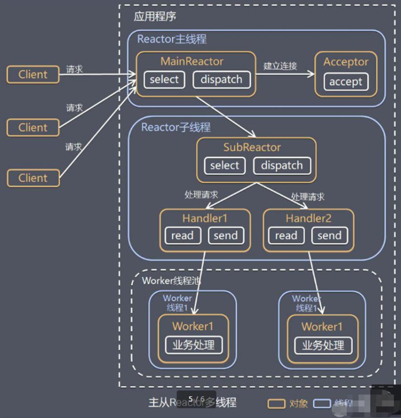

# Netty探索

## Reactor线程模式

### Reactor单线程工作模型

 

### Reactor多线程工作模型

 

### Reactor主从工作模型

 

### Reactor主从详细模型讲解
 
 * 1）Netty抽象出两组线程池
 *  BossGroup专门负责接收客户端的连接
 *  WorkerGroup专门负责网络的读写
 * 2）BossGroup和WorkerGroup类型都是NioEventLoopGroup
 * 3）NioEventLoopGroup相当于一个事件循环组，这个组中含有多个事件循环，每一个事件循环是NioEventLoop
 * 4）NioEventLoop表示一个不断循环的执行处理任务的线程，每个NioEventLoop都有一个selector，用于监听绑定在其上面的socket网络通信
 * 5）NioEventLoopGroup可以有多个线程，即可以含有多个NioEventLoop
 * 6）每个Boss NioEventLoop循环执行的步骤：
 *      1.轮询accept事件
 *      2.处理accept事件，与client简历连接，生成NioSocketChannel，并将其注册到worker NIOEventLoop上的selector
 *      3.处理任务队列的任务，即runAllTasks
 * 7）每个Worker NioEventLoop循环执行的步骤
 *      1.轮询read，write事件
 *      2.处理io事件，即read，write事件，在对应的NioSocketChannel上处理
 *      3.处理任务队列的任务，即runAllTasks
 * 8)每个Worker NIOEventLoop处理业务时候会使用Pipeline管道，pipeline中包含了channel，即通过pipeline可以获取到对应通道，pipeline中维护了很多处理器

### Pipeline

 

