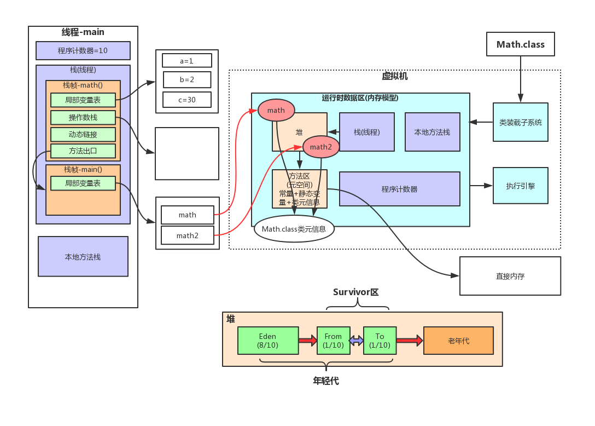

# Jvm学习

[多线程知识点讲解](../README.md)

#### 每个线程运行时候私有空间：

* 线程栈
    * 局部变量表
    * 操作数栈
    * 动态链接
    * 方法出口
* 本地方法栈
* 程序计数器

#### 所有线程运行时候公有空间：

* 堆
* 方法区

# Java内存模型

## 堆

### 年轻代

默认大概占整个堆的1/3空间

其中Eden:s0:s1 = 8:1:1

#### Eden

新new出来的对象放这里 
占整个年轻代8/10的空间 
满了会有单独线程进行minor gc 
GC Root可达性分析 
从GCRoot开始(方法区的静态引用，栈中局部变量表的对象引用都可以作为GCRoot)进行引用关联判断 
垃圾回收线程会不断标记可用的对象，然后将这些可用对象复制到s0区域

#### Survivor

占整个年轻代2/10的空间 
s0:s1->s0和s1中的存活对象不断进行交换 
分代年龄-->经过几次垃圾回收 
当分带年龄=15的时候会被放入老年代 

### 老年代

默认大概占整个堆的2/3空间

存放很久不会被回收的对象

* 静态变量
* springBean
* 线程池
* 缓存的对象

full gc 会回收整个堆的内存空间

## 栈

java虚拟机给每个线程分配一快内存空间，成为线程栈

### 栈帧

线程栈中给每个方法分配的内存区域成为栈帧

递归（会不断的在线程栈中分配栈帧...所以会出现StackOverflowError栈溢出）

随着方法执行会不断压栈，等方法执行完就出栈，释放空间，符合我们程序运行规律

例如线程执行m1,m2方法，首先执行m1，则m1压栈，执行m2，则m2压栈，m2执行完则m2出栈，然后m1执行完，m1出栈

javap -c JavaApp.class 反编译java字节码为编译文件

>局部变量表 

32位长度 4个字节

* 基本类型变量 
a = 1 
b = 2 
* 对象引用 
Person p = new Person()

>操作数栈 

程序变量在做运算的过程中值暂存的地方 
常量压栈：压入操作数栈中 
常量出栈：从栈中弹出操作数 

>动态链接 

>方法出口 

方法执行完返回被调用者的执行位置

## 方法区

jdk1.8之后用的是直接内存，而非虚拟机分配的内存 

* 常量
public static final int a = 1;
* 静态变量
public static User b = new User();
* 类信息

## 本地方法区

native修饰的方法，底层用c语言实现的本地方法
也叫本地方法栈，本地方法运行时候java虚拟机给它分配的一块内存空间

## 程序计数器

每个线程都有自己的程序计数器，有一块专属的内存空间
程序计数器记录程序执行的位置，防止cpu切换执行其他任务时候丢失上次执行任务位置

# Java虚拟机调优

## 背景：
gc的时候会停止所有用户线程
## 目的：
减少full gc
## 
-Xmx3072M
-Xms3072M
-Xmn2048M                   年轻代大小
-Xss1M
-XX:MetaspaceSize = 256M    
-XX:MaxMetaspaceSize = 256M 

